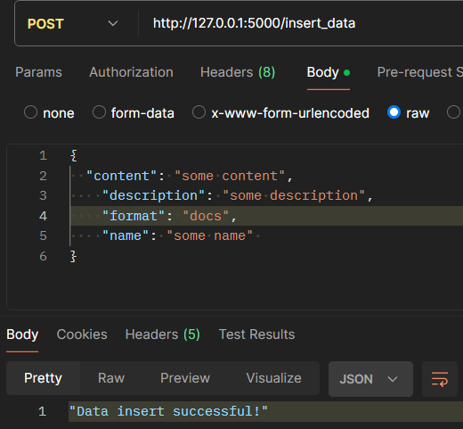
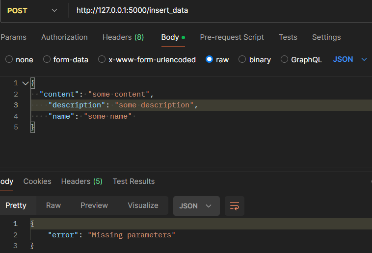
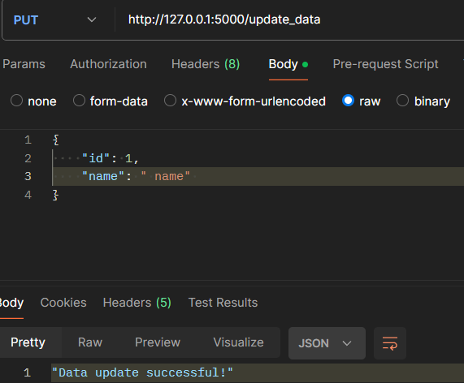
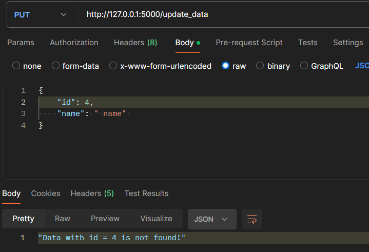
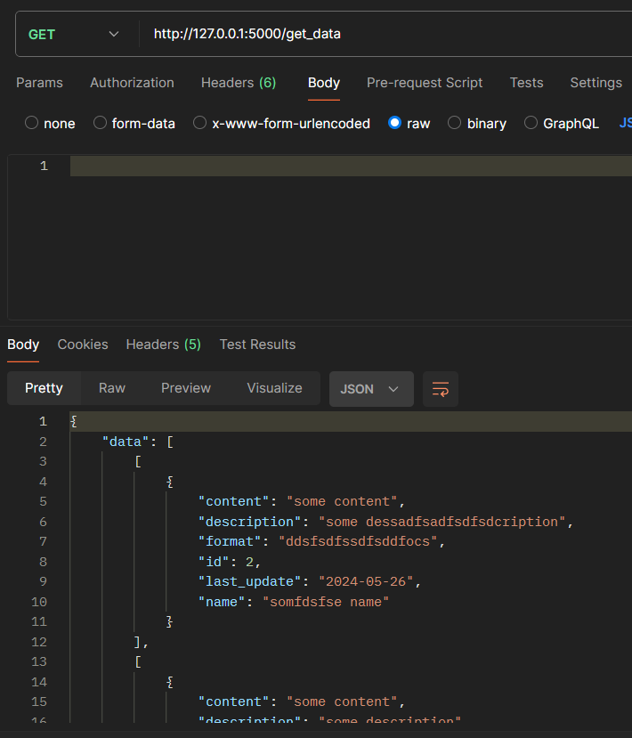
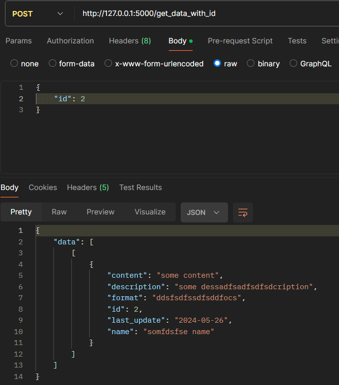
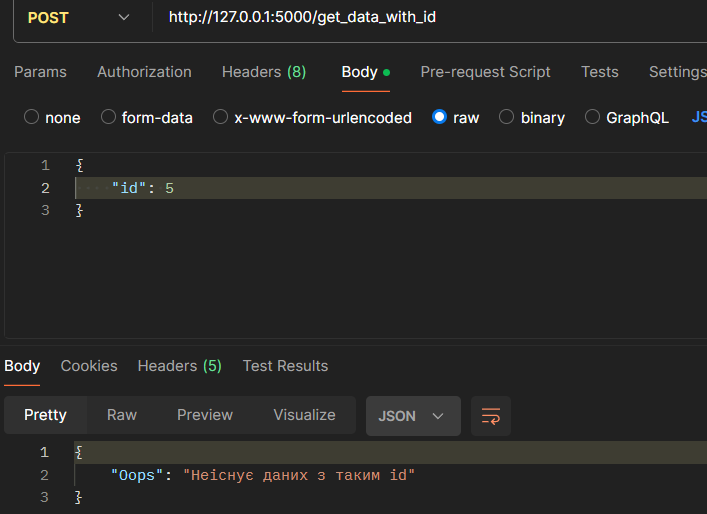
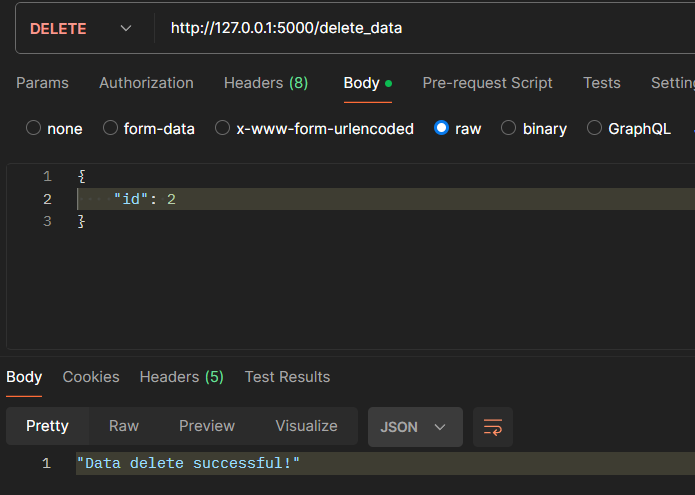
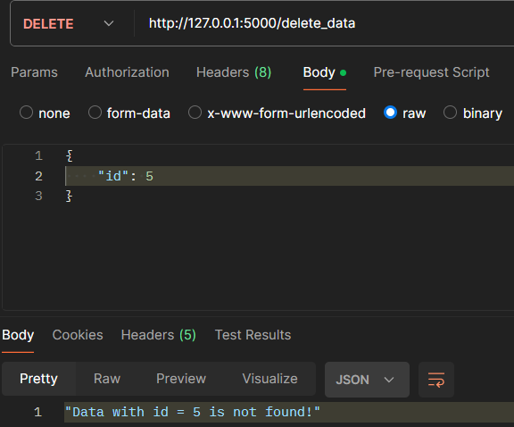

# Тестування працездатності системи

Тестування системи проводилось за допомогою застосунку Postman

## Створення файлу з даними
### Успішне створення

### Неуспішне створення

### Успішна зміна даних

### Неуспішне зміна даних

## Отримання даних
### Отримання всіх даних

### Успішне отримання даних за id

### Неуспішне отримання даних за id

## Видалення файлу
### Успішне видалення файлу

### Неуспішне видалення файлу

